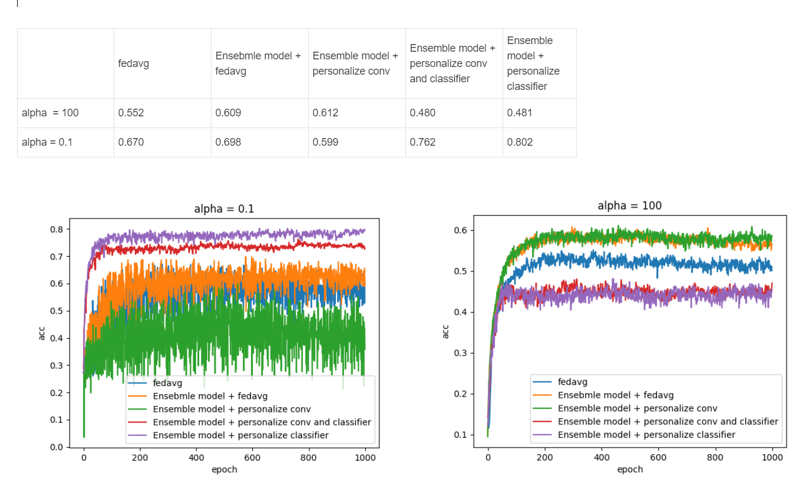

## cifar10

###     dirichlet 类别不平衡
#### 1.  Lenet 模型 ，fedavg聚合
#### 2.  Ensemble 模型， fedavg聚合
#### 3.  Ensemble 模型， 个性化最后一层卷积层，分类器依旧聚合
#### 4.  Ensemble 模型， 个性化最后一层卷积层，分类器不聚合
#### 5.  Ensemble 模型， 分类器不聚合，其它聚合
####     执行命令
        python3 main.py  --dataset cifar10 --num_classes 10 --epochs 1000 --num_users 4 --local_ep 1 --local_bs 100 --train_num 1000 --lr 0.01 \
        --policy 1   \
        --iid 0 --noniid dirichlet --alpha 1  \
        --name cifar10_alpha_d_1_P_1

        python3 main.py  --dataset cifar10 --num_classes 10 --epochs 1000 --num_users 4 --local_ep 1 --local_bs 100 --train_num 1000 --lr 0.01 \
        --policy 2   \
        --iid 0 --noniid dirichlet --alpha 1  \
        --name cifar10_alpha_d_1_P_2

        python3 main.py  --dataset cifar10 --num_classes 10 --epochs 1000 --num_users 4 --local_ep 1 --local_bs 100 --train_num 1000 --lr 0.01 \
        --policy 3   \
        --iid 0 --noniid dirichlet --alpha 1  \
        --name cifar10_alpha_d_1_P_3

        python3 main.py  --dataset cifar10 --num_classes 10 --epochs 1000 --num_users 4 --local_ep 1 --local_bs 100 --train_num 1000 --lr 0.01 \
        --policy 4   \
        --iid 0 --noniid dirichlet --alpha 1  \
        --name cifar10_alpha_d_1_P_4

        python3 main.py  --dataset cifar10 --num_classes 10 --epochs 1000 --num_users 4 --local_ep 1 --local_bs 100 --train_num 1000 --lr 0.01 \
        --policy 5   \
        --iid 0 --noniid dirichlet --alpha 1  \
        --name cifar10_alpha_d_1_P_5

### 目前的实验结果
