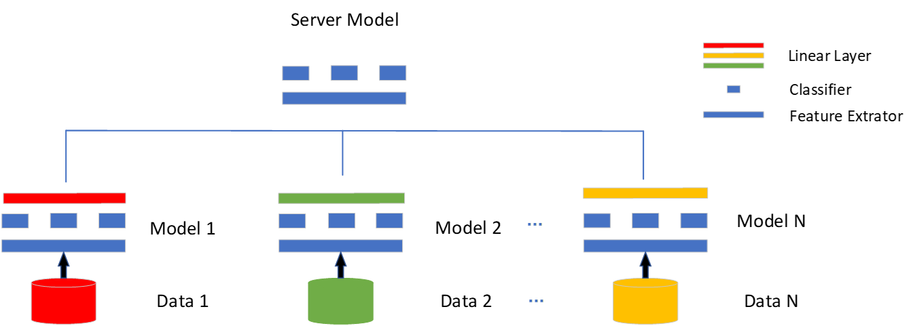

#主要思想
    解决的问题：联邦学习数据异质性
    导致的问题：模型异质性，模型融合后效果下降
    加强模型融合的效果，除了模型聚合，还有模型的蒸馏
    目前方法存在的问题：Fedprox 加入近端项限制本地模型和全局模型的距离，限制了本地模型的发挥
    解决方法： 将集成学习引入到联邦学习中，共同训练M个模型，第i个设备选m个，本地信息交流：模型的互学习，全局的模型交流：信息融合
    优点：引入更鲁棒的集成学习方法

save_backup: 初始化不同：先分发
save_bacup2: 初始化：先聚合后分发
policy = 2,ensemble learning + mixture
policy = 4，Ensemble learning
policy = 5, Ensemble learning + mixture 优化
    最简单的mixture of experts实现

202305052 update
1. 增加公开数据集
2. 20个client，每五个一簇使用不同结构的模型
    policy = 6
    policy = 6

## cifar10

#### policy 3

### 

        python3 main.py  --dataset cifar10 --num_classes 10 --epochs 500  --num_users 32 --local_ep 5 --local_bs 100 --train_num 500  --test_num 100 --lr 0.01 \
        --policy 0  \
        --iid 0 --noniid dirichlet --alpha 0.5  \
        --global_test_data_num 1000 \
        --name cifar10_alpha_d_0.5_P_0

        python3 main.py  --dataset cifar10 --num_classes 10 --epochs 500  --num_users 20 --local_ep 5 --local_bs 100 --train_num 500 --test_num 100 --lr 0.01 \
        --policy 2   \
        --iid 0 --noniid dirichlet --alpha 0.5  \
        --model_num 1 --model_num_per_client 1 \
        --name cifar10_alpha_d_0.5_P_2

        python3 main.py  --dataset cifar10 --num_classes 10 --epochs 500  --num_users 20 --local_ep 5 --local_bs 100 --train_num 500 --test_num 100 --lr 0.1 \
        --policy 2   \
        --iid 0 --noniid dirichlet --alpha 1  \
        --model_num 1 --model_num_per_client 1 \
        --global_test_data_num 1000 \
        --name cifar10_alpha_1_P_2
#### 验证代码正确性
        mnist 数据集
        iid

        noniid

       cifar10 数据集
        iid
        
        python3 main.py  --dataset cifar10 --num_classes 10 --epochs 500  --num_users 20 --local_ep 5 --local_bs 100 --train_num 500 --test_num 100 --lr 0.1 \
        --policy 1   \
        --iid 0 --noniid dirichlet --alpha 100  \
        --global_test_data_num 1000 \
        --name cifar10_alpha_d_100_P_1

        python3 main.py  --dataset cifar10 --num_classes 10 --epochs 500  --num_users 20 --local_ep 5 --local_bs 100 --train_num 500 --test_num 100 --lr 0.1 \
        --policy 2   \
        --iid 0 --noniid dirichlet --alpha 100  \
        --model_num 1 --model_num_per_client 1 \
        --global_test_data_num 1000 \
        --name cifar10_alpha_d_100_P_2

        noniid
        python3 main.py  --dataset cifar10 --num_classes 10 --epochs 500  --num_users 20 --local_ep 5 --local_bs 100 --train_num 500 --test_num 100 --lr 0.1 \
        --policy 1   \
        --iid 0 --noniid dirichlet --alpha 0.1  \
        --global_test_data_num 1000 \
        --name cifar10_alpha_d_0.1_P_1

        python3 main.py  --dataset cifar10 --num_classes 10 --epochs 500  --num_users 20 --local_ep 5 --local_bs 100 --train_num 500 --test_num 100 --lr 0.1 \
        --policy 2   \
        --iid 0 --noniid dirichlet --alpha 0.1  \
        --model_num 1 --model_num_per_client 1 \
        --global_test_data_num 1000 \
        --name cifar10_alpha_d_0.1_P_2
#### 验证多模型是否有好处

        python3 main.py  --dataset cifar10 --num_classes 10 --epochs 500  --num_users 20 --local_ep 5 --local_bs 100 --train_num 500 --test_num 100 --lr 0.1 \
        --policy 2   \
        --iid 0 --noniid dirichlet --alpha 100  \
        --model_num 3 --model_num_per_client 3 \
        --global_test_data_num 1000 \
        --name cifar10_alpha_d_100_P_2

#### 验证采样的好处
        python3 main.py  --dataset cifar10 --num_classes 10 --epochs 500  --num_users 20 --local_ep 5 --local_bs 100 --train_num 500 --test_num 100 --lr 0.1 \
        --policy 2   \
        --iid 0 --noniid dirichlet --alpha 1  \
        --model_num 20 --model_num_per_client 2 \
        --global_test_data_num_num 1000 \
        --name cifar10_alpha_d_1_P_2

