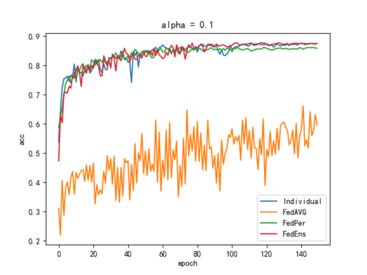
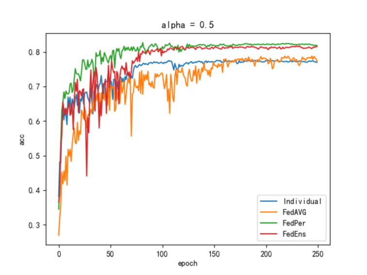
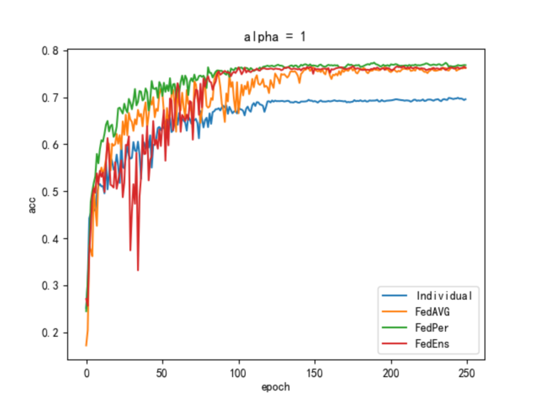
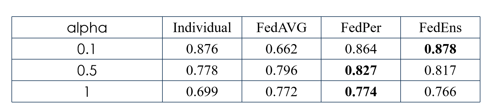

## cifar10

### 

#### 0.  Res ，单独训练
#### 1.  Res 模型， fedavg聚合
#### 2.  ResEns 模型， 个性化分类器，拼接特征
#### 3.  Res模型， 个性化分类器

        python3 main.py  --dataset cifar10 --num_classes 10 --epochs 500  --num_users 32 --local_ep 1 --local_bs 100 --train_num 500  --test_num 100 --lr 0.01 \
        --policy 0  \
        --iid 0 --noniid dirichlet --alpha 0.5  \
        --name cifar10_alpha_d_0.5_P_0

        python3 main.py  --dataset cifar10 --num_classes 10 --epochs 500  --num_users 32 --local_ep 1 --local_bs 100 --train_num 500 --test_num 100 --lr 0.01 \
        --policy 1   \
        --iid 0 --noniid dirichlet --alpha 0.5  \
        --name cifar10_alpha_d_0.5_P_1

        python3 main.py  --dataset cifar10 --num_classes 10 --epochs 500  --num_users 32 --local_ep 1 --local_bs 100 --train_num 500 --test_num 100 --lr 0.01 \
        --policy 2   \
        --iid 0 --noniid dirichlet --alpha 0.5  \
        --name cifar10_alpha_d_0.5_P_2

        python3 main.py  --dataset cifar10 --num_classes 10 --epochs 500  --num_users 32 --local_ep 1 --local_bs 100 --train_num 500 --test_num 100 --lr 0.01 \
        --policy 3   \
        --iid 0 --noniid dirichlet --alpha 0.5  \
        --name cifar10_alpha_d_0.5_P_3
# cifar100
## 0.01 0.1 0.5
        python3 main.py  --dataset cifar100 --num_classes 100 --epochs 500  --num_users 32 --local_ep 1 --local_bs 100 --train_num 500  --test_num 100 --lr 0.01 \
        --policy 0  \
        --iid 0 --noniid dirichlet --alpha 0.5  \
        --name cifar100_alpha_d_0.5_P_0

        python3 main.py  --dataset cifar100 --num_classes 100 --epochs 500  --num_users 32 --local_ep 1 --local_bs 100 --train_num 500  --test_num 100 --lr 0.01 \
        --policy 1  \
        --iid 0 --noniid dirichlet --alpha 0.5  \
        --name cifar100_alpha_d_0.5_P_1

        python3 main.py  --dataset cifar100 --num_classes 100 --epochs 500  --num_users 32 --local_ep 1 --local_bs 100 --train_num 500  --test_num 100 --lr 0.01 \
        --policy 2  \
        --iid 0 --noniid dirichlet --alpha 0.5  \
        --name cifar100_alpha_d_0.5_P_2

        python3 main.py  --dataset cifar100 --num_classes 100 --epochs 500  --num_users 32 --local_ep 1 --local_bs 100 --train_num 500  --test_num 100 --lr 0.01 \
        --policy 3  \
        --iid 0 --noniid dirichlet --alpha 0.5  \
        --name cifar100_alpha_d_0.5_P_3
# mnist 
        python3 main.py  --dataset mnist --num_classes 10 --epochs 500  --num_users 32 --local_ep 1 --local_bs 100 --train_num 500 --test_num 100 --lr 0.01 \
        --policy 0  \
        --iid 0 --noniid dirichlet --alpha 0.5  \
        --name mnist_alpha_d_0.5_P_0

        python3 main.py  --dataset mnist --num_classes 10 --epochs 500  --num_users 32 --local_ep 1 --local_bs 100 --train_num 500 --test_num 100 --lr 0.01 \
        --policy 1   \
        --iid 0 --noniid dirichlet --alpha 0.5  \
        --name mnist_alpha_d_0.5_P_1

        python3 main.py  --dataset mnist --num_classes 10 --epochs 500  --num_users 32 --local_ep 1 --local_bs 100 --train_num 500 --test_num 100 --lr 0.01 \
        --policy 2   \
        --iid 0 --noniid dirichlet --alpha 0.5  \
        --name mnist_alpha_d_0.5_P_2

        python3 main.py  --dataset mnist --num_classes 10 --epochs 500  --num_users 32 --local_ep 1 --local_bs 100 --train_num 500 --test_num 100 --lr 0.01 \
        --policy 3   \
        --iid 0 --noniid dirichlet --alpha 0.5 \
        --name mnist_alpha_d_0.5_P_3

更换模型之前
###     dirichlet 类别不平衡
#### 1.  Lenet 模型 ，fedavg聚合
#### 2.  Ensemble 模型， fedavg聚合
#### 3.  Ensemble 模型， 个性化最后一层卷积层，分类器依旧聚合
#### 4.  Ensemble 模型， 个性化最后一层卷积层，分类器不聚合
#### 5.  Ensemble 模型， 分类器不聚合，其它聚合
####     执行命令
        python3 main.py  --dataset cifar10 --num_classes 10 --epochs 500  --num_users 32 --local_ep 1 --local_bs 100 --train_num 500 --test_num 100 --lr 0.01 \
        --policy 1   \
        --iid 0 --noniid dirichlet --alpha 0.5  \
        --name cifar10_alpha_d_0.5_P_1

        python3 main.py  --dataset cifar10 --num_classes 10 --epochs 500  --num_users 32 --local_ep 1 --local_bs 100 --train_num 500 --test_num 100 --lr 0.01 \
        --policy 2   \
        --iid 0 --noniid dirichlet --alpha 0.5  \
        --name cifar10_alpha_d_0.5_P_2

        python3 main.py  --dataset cifar10 --num_classes 10 --epochs 500  --num_users 32 --local_ep 1 --local_bs 100 --train_num 500 --test_num 100 --lr 0.01 \
        --policy 3   \
        --iid 0 --noniid dirichlet --alpha 0.5  \
        --name cifar10_alpha_d_0.5_P_3

        python3 main.py  --dataset cifar10 --num_classes 10 --epochs 500  --num_users 32 --local_ep 1 --local_bs 100 --train_num 500 --test_num 100 --lr 0.01 \
        --policy 4   \
        --iid 0 --noniid dirichlet --alpha 0.5  \
        --name cifar10_alpha_d_0.5_P_4

        python3 main.py  --dataset cifar10 --num_classes 10 --epochs 500  --num_users 32 --local_ep 1 --local_bs 100 --train_num 500 --test_num 100 --lr 0.01 \
        --policy 5   \
        --iid 0 --noniid dirichlet --alpha 0.5  \
        --name cifar10_alpha_d_0.5_P_5

### 目前的实验结果

